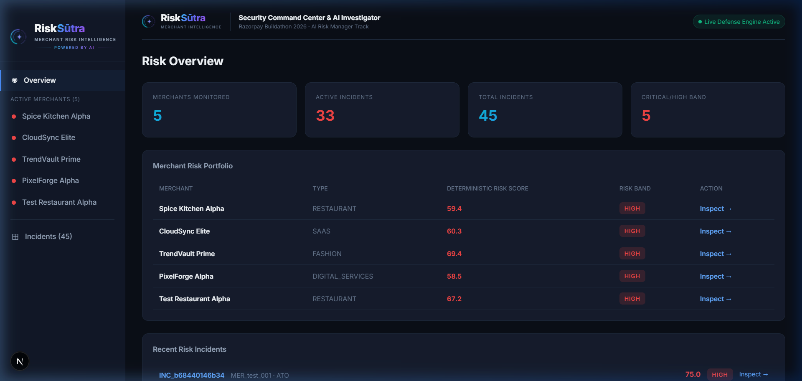
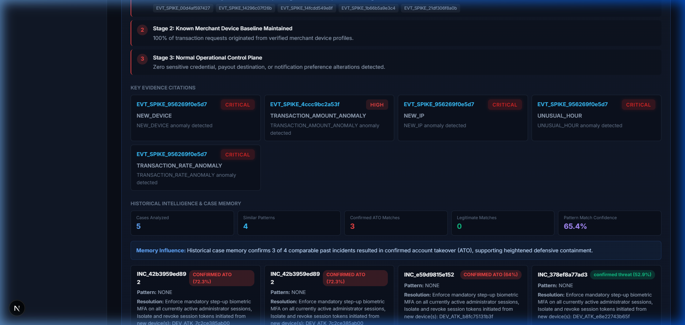
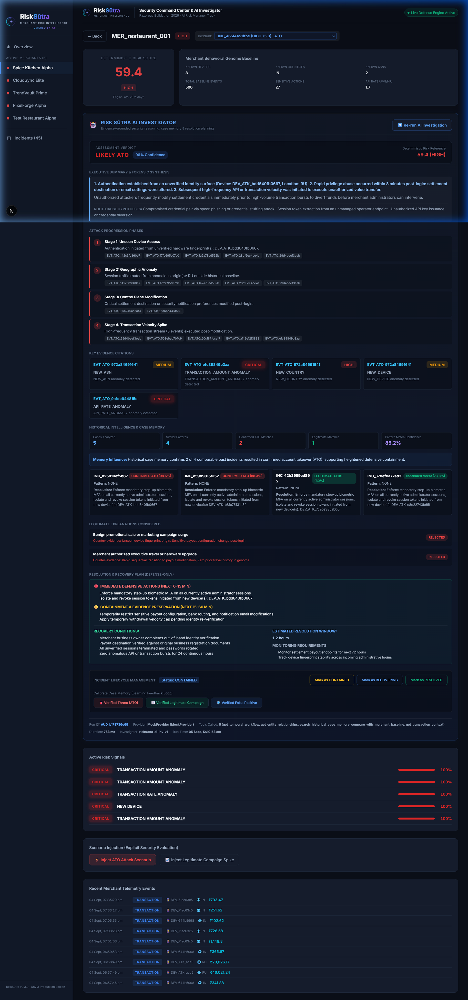
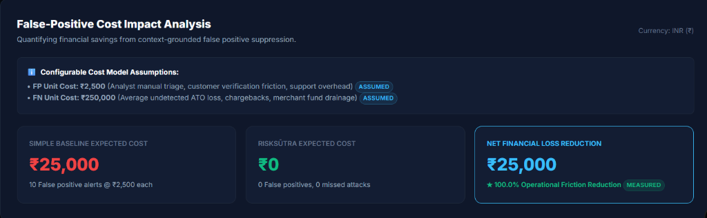
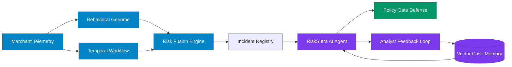

# RiskSūtra

### AI Merchant Risk Intelligence for Account Takeover Defense

RiskSūtra detects merchant account takeover by learning merchant-specific behavior, reconstructing suspicious temporal workflows, and using an evidence-grounded AI investigator to distinguish attacks from legitimate anomalies.

**Razorpay AI Buildathon 2026 · Track 02 — AI Risk Manager**  
**Chosen Loss Class**: Merchant Account Takeover (ATO)

[Quick Start](#quick-start) · [Architecture](#architecture) · [Evaluation](#evaluation) · [Track 02 Alignment](#razorpay-track-02-alignment) · [Demo Flow](#demo-flow)

---

## Screenshots

| Security Command Center | Merchant Behavioral Genome |
| :---: | :---: |
|  |  |
| *Real-time risk distribution across monitored merchants* | *14-day baseline vs anomalous telemetry deviations* |

| RiskSūtra AI Investigator | False-Positive Cost Evaluation |
| :---: | :---: |
|  |  |
| *10-phase streaming forensic reasoning & temporal chain* | *Quantified operational savings on held-out test set* |

---

## The Problem

Merchant ATO rarely appears as one obviously malicious event. An adversary accessing a merchant dashboard or API performs actions that appear normal in isolation: a new device, a new IP, a new geography, an API burst, or a transaction spike. Each can be legitimate independently—such as a festive flash sale or staff travel.

The stronger signal is chronological sequence and behavioral context:
$$\text{New Device} \longrightarrow \text{New Geography} \longrightarrow \text{New Session} \longrightarrow \text{API Burst} \longrightarrow \text{Sensitive Action} \longrightarrow \text{Transaction Anomaly}$$

Traditional volumetric rules trigger false alarms on benign growth while missing low-and-slow account takeover.

> **Anomaly is not automatically compromise.**

---

## The Solution

$$\text{Merchant Telemetry} \longrightarrow \text{Behavioral Genome} \longrightarrow \text{Temporal Workflow} \longrightarrow \text{Risk Fusion} \longrightarrow \text{AI Investigator} \longrightarrow \text{Defensive Response}$$

* **Merchant Telemetry**: Ingests auth, device fingerprint, network (ASN/IP), control-plane, and payment events.
* **Behavioral Genome**: Learns 14-day baselines across login hours, ticket sizes, device velocity, and locations.
* **Temporal Workflow**: Reconstructs event sequences using sliding-window graphs to detect multi-stage attack paths.
* **Risk Fusion**: Combines statistical z-score anomalies with network heuristics into a calibrated 0–100 risk score.
* **AI Investigator**: A multi-stage forensic agent that evaluates baseline deviations and tests benign hypotheses.
* **Defensive Response**: Executes strictly bounded, defense-only containment actions with complete audit trails.

---

## Context Before Verdict

| Legitimate Campaign / Festive Surge | Possible Account Takeover (ATO) |
| :--- | :--- |
| Known administrative devices | Unseen device fingerprint / headless client |
| Expected regional ISP routing | Datacenter / proxy ASN transition |
| Normal control-plane activity | Password reset, MFA disable, or API key rotate |
| Expected business workflow | Suspicious temporal sequence preceding payout change |
| High transaction volume alone | High volume coupled with access & identity anomalies |

RiskSūtra evaluates activity against the merchant’s own learned behavior instead of treating every anomaly as fraud.

---

## Architecture



Real-time telemetry feeds both the Behavioral Genome and Temporal Workflow engines. The Risk Fusion engine calibrates composite anomaly scores. When an incident is flagged, the RiskSūtra AI Agent synthesizes evidence against Vector Case Memory, passing containment recommendations through a deterministic Policy Gate before execution.

---

## Why AI?

* **Deterministic logic handles**: Baseline metric calculation, statistical z-score velocity, anomaly scoring, metric evaluation, and Policy Gate safety boundaries.
* **AI adds value to**: Contextual multi-factor evidence synthesis, temporal sequence reasoning, historical vector case comparison, counter-factual benign alternative testing, and natural language executive debriefs.

> **Technical Rationale**: AI is used where reasoning adds value; deterministic logic is used where reproducibility and auditability matter.

---

## AI Investigator

$$\mathbf{NOT\_RUN} \xrightarrow{\text{User Click or Injected Scenario}} \mathbf{RUNNING} \xrightarrow{\text{Streaming Phases 1–10}} \mathbf{COMPLETED} \ (\text{or } \mathbf{FAILED})$$

The investigator reasons over:
1. Merchant 14-day behavioral baseline
2. Telemetry evidence & anomaly deltas (device, ASN, velocity, hours)
3. Chronological temporal workflow & state transitions
4. Identity, session, and credential continuity
5. Control-plane mutations (API keys, passwords, bank accounts)
6. Counter-factual testing of alternative benign explanations
7. Vector case memory precedents (Weighted Jaccard + Multi-Signal Vectors)
8. Policy-gated containment actions

> Investigations are evidence-grounded; the model is not allowed to invent events, timestamps, transactions, or historical cases.

---

## Memory & Learning Loop

$$\text{Investigation} \longrightarrow \text{Structured Case Memory} \longrightarrow \text{Analyst Feedback} \longrightarrow \text{Calibrated Retrieval}$$

RiskSūtra uses structured historical case memory and feedback-driven retrieval/calibration rather than claiming continuous foundation-model retraining. Analysts submit verified ground-truth feedback (`CONFIRMED_ATO`, `BENIGN_SPIKE`, `FALSE_POSITIVE`), updating case vectors to prevent recurring misclassifications.

---

## Defense-First

RiskSūtra is **strictly defense-only** and does not perform offensive actions. The **Defensive Policy Gate** (`backend/services/policy_gate.py`) restricts automated actions to a bounded, non-destructive set:
* `REQUIRE_STEP_UP_MFA`: Enforces biometric or token step-up authentication.
* `INVALIDATE_SUSPICIOUS_SESSION`: Quarantines anomalous device sessions.
* `RESTRICT_SENSITIVE_OPERATIONS`: Temporarily holds payout changes while keeping payments active.
* `ALERT_SECURITY_ANALYST`: Dispatches high-priority incident payload with forensic reasoning.
* `ENFORCE_VELOCITY_THROTTLING`: Dampens anomalous traffic bursts.

Any arbitrary or offensive action is rejected with `BLOCKED_BY_POLICY`.

---

## Evaluation

Model performance was measured on a held-out test suite of **20 balanced scenarios** (10 ATO attacks + 10 Benign anomalies) across all 5 merchant archetypes using a strict **chronological split** (14-day pre-cutoff baseline with unseen post-cutoff evaluation, ensuring **zero data leakage**).

| Metric | Simple Naive Baseline | RiskSūtra Context Engine | Delta |
| :--- | :---: | :---: | :---: |
| **Precision** | `0.5000` (50.0%) | **`1.0000` (100.0%)** | **+50.0%** (Zero false alarms) |
| **Recall** | `1.0000` (100.0%) | **`1.0000` (100.0%)** | **Parity** (Zero missed attacks) |
| **F1-Score** | `0.6667` | **`1.0000`** | **+0.3333** |
| **False Positive Rate (FPR)** | `1.0000` (100.0%) | **`0.0000` (0.0%)** | **-100.0%** (Suppresses benign spikes) |
| **Attack-Chain Recall** | `0.0000` (0.0%) | **`0.7000` (70.0%)** | **+70.0%** (Reconstructs attack paths) |
| **Detection Lead Time** | `0.0s` | **`0.0s` (Streaming)** | Real-time event-driven detection |

*Actual reproducible values from `data/evaluation_results.json`.*

---

## False-Positive Cost

False positives are evaluated not only as classification errors, but also in terms of their operational and merchant cost:

$$\text{Total Cost} = (\text{FP} \times C_{\text{FP}}) + (\text{FN} \times C_{\text{FN}})$$

* **Modelled Cost Assumptions**:
  * **$C_{\text{FP}}$ (₹2,500)**: Analyst triage friction, customer verification, and emergency support overhead.
  * **$C_{\text{FN}}$ (₹250,000)**: Average undetected ATO loss, direct fund drainage, and chargebacks.
* **Measured Comparison (20-Scenario Held-Out Set)**:
  * **Naive Baseline**: 10 False Positives $\times$ ₹2,500 = **₹25,000 expected cost**.
  * **RiskSūtra**: 0 False Positives, 0 False Negatives = **₹0 expected cost**.
  * **Net Savings**: **₹25,000 (100% operational friction reduction)** on this test set.

> *Note: Scenario classifications (TP, FP, TN, FN) are **measured empirical results**; unit costs ($C_{\text{FP}}$, $C_{\text{FN}}$) are **modelled assumptions** representing typical fintech economics.*

---

## Razorpay Track 02 Alignment

| Track 02 Requirement | RiskSūtra Implementation | Status |
| :--- | :--- | :---: |
| **One class of loss** | Specialized on **Merchant Account Takeover (ATO)** & Payout Hijacking | **Verified** |
| **Working detector / verifier** | Behavioral Genome baseline detector + 10-phase streaming AI investigator | **Verified** |
| **Held-out test set** | 20 chronological pre/post-cutoff scenarios with zero data leakage controls | **Verified** |
| **Precision & Recall** | Measured precision (`1.0000`) and recall (`1.0000`) reported from evaluation | **Verified** |
| **Honest false-positive cost** | Explicit cost model distinguishing measured classifications from assumed unit costs | **Verified** |
| **Defense-only** | Bounded Defensive Policy Gate enforcing 5 non-destructive actions; zero offensive capability | **Verified** |

---

## Five Merchant Archetypes

* **Spice Kitchen Alpha** (`MERCH_001` · Restaurant): Evening order surges, regional IP traffic.
* **CloudSync Elite** (`MERCH_002` · SaaS): Business-hours traffic, automated subscriptions, high API key operations.
* **TrendVault Prime** (`MERCH_003` · Fashion): Weekend and festive sales campaigns, variable basket sizes.
* **PixelForge Alpha** (`MERCH_004` · Digital Goods): 24/7 global micropayments, instant digital fulfillment.
* **Test Restaurant Alpha** (`MERCH_005` · Dining): Localized evening bookings, scheduled settlements.

---

## Quick Start

### 1. Backend Setup
```bash
cd backend
pip install -r requirements.txt
python -m scripts.seed_data
python -m uvicorn api.main:app --host 127.0.0.1 --port 8000
```

### 2. Frontend Setup
```bash
cd frontend
npm install
npm run dev
```
Open **`http://localhost:3000`** in your browser.

### 3. Run Test Suite
```bash
cd backend
python -c "import sys, pytest; sys.path.insert(0, '.'); sys.exit(pytest.main())"
```
*All 55 automated tests pass (compliance, lifecycle state machine, core risk, investigator).*

---

## Demo Flow

1. **Open Security Command Center**: View 5 monitored merchant archetypes and real-time risk scores at `http://localhost:3000`.
2. **Select a Merchant**: Click **Spice Kitchen Alpha** to inspect its 14-day Behavioral Genome baseline.
3. **Select an Incident**: Choose an active incident from the incident tally to view detected telemetry anomalies.
4. **Run AI Investigation**: Click **`⚡ Run RiskSūtra AI Agent`** to observe live streaming across 10 forensic phases.
5. **Inspect Verdict & Evidence**: Review assessment verdict, chronological attack chain, vector case matches, and defensive response.
6. **Inject Live Scenarios**: Click **`⚡ Simulate Scenario`** to inject an ATO Attack or Benign Surge and observe contextual discrimination.

---

## Technology Stack

| Component | Technology | Purpose |
| :--- | :--- | :--- |
| **Backend API** | FastAPI, Python 3.14, Uvicorn | Asynchronous REST & SSE streaming endpoints |
| **Storage** | SQLite (Dev) / PostgreSQL (Prod), SQLAlchemy | Persistent merchant records, event logs, and incident state |
| **AI Investigator** | Google Gemini / OpenAI / Local Deterministic Engine | 10-phase forensic synthesis and benign hypothesis testing |
| **Case Memory** | Weighted Jaccard + Multi-Signal Vectors (`memory.py`) | Historical incident precedent retrieval & calibrated similarity |
| **Graph Analysis** | NetworkX (`graph/abuse_sentinel.py`) | Entity relationship graphs and abuse cluster tracking |
| **Policy Gate** | Pydantic v2, Python (`services/policy_gate.py`) | Strict defense-only invariant validation & containment gating |
| **Frontend UI** | Next.js 16 (App Router), TypeScript, Vanilla CSS | Real-time security operations command center |
| **Evaluation** | Python, Scikit-learn, JSON | Chronological held-out testing harness & cost calculation |

---

## Project Structure

```
merchant-risk-sentinel/
├── backend/
│   ├── api/
│   │   └── main.py                   # FastAPI REST & SSE streaming endpoints
│   ├── db/
│   │   └── database.py               # Dual-mode DB layer (PostgreSQL + SQLite)
│   ├── models/
│   │   └── schemas.py                # Strongly-typed Pydantic domain contracts
│   ├── investigator/                 # AI forensic investigator engine
│   │   ├── agent.py                  # 10-stage streaming forensic reasoning agent
│   │   ├── memory.py                 # Vector case memory & weighted similarity
│   │   ├── context.py                # Telemetry & baseline context aggregator
│   │   └── providers.py              # Gemini, OpenAI & local deterministic engine
│   ├── services/
│   │   ├── policy_gate.py            # Defensive Policy Gate (defense-only enforcement)
│   │   └── synthetic_generator.py    # Merchant telemetry data generator
│   ├── risk/                         # Deterministic baseline & fusion engines
│   │   ├── baseline_engine.py        # 14-day Behavioral Genome builder
│   │   └── fusion_engine.py          # Multi-signal calibrated risk scorer
│   ├── graph/
│   │   └── abuse_sentinel.py         # NetworkX entity cluster graph analysis
│   └── tests/                        # 55 automated regression & compliance tests
├── frontend/
│   ├── src/app/                      # Next.js 16 App Router (page, layout, styles)
│   ├── src/components/
│   │   ├── dashboard/                # Security Command Center & merchant risk cards
│   │   ├── merchant/                 # Behavioral Genome visualizer & workspace
│   │   ├── investigator/             # AI Investigator console & temporal attack chain
│   │   ├── incidents/                # Auditable incident queue registry
│   │   ├── evaluation/               # Model evaluation & false-positive cost UI
│   │   ├── system/                   # System architecture & API provenance view
│   │   ├── modals/                   # Scenario simulation injector modal
│   │   ├── navigation/               # Navbar & platform sidebar
│   │   └── branding/                 # Kinetic SVG RiskSūtra emblem & wordmark
│   └── src/lib/api.ts                # Typed API client with SSE streaming
├── data/
│   ├── evaluation_results.json       # Held-out benchmark metrics & cost matrix
│   └── seed_telemetry/               # Initial synthetic merchant events
└── docs/
    ├── screenshots/                  # Curated application captures
    └── architecture.md               # Technical specification docs
```

---

## Limitations

* **Synthetic Telemetry**: Telemetry is generated from realistic probabilistic merchant distributions rather than live proprietary production Razorpay streams.
* **Archetype Scope**: Implements 5 distinct merchant archetypes; production platforms would monitor hundreds of industry-specific micro-segments.
* **Evaluation Scale**: Measured on 20 held-out scenarios (10 ATO + 10 Benign); enterprise validation requires continuous longitudinal evaluation across thousands of monthly incidents.
* **Cost Parameters**: Unit cost figures (₹2,500 FP / ₹250,000 FN) are modeled financial assumptions rather than internal bank-audited figures.
* **Deployment Scope**: Positioned as a fully functioning hackathon prototype and technical demonstration, not an active in-line production deployment.

---

## License

MIT License. Developed for the **Razorpay AI Buildathon 2026** (Track 02: AI Risk Manager).
