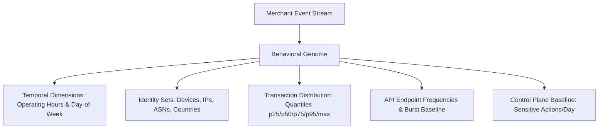

# RiskSūtra — Merchant Behavioral Genome Specification

> **Module**: `backend/risk/baseline_engine.py`  
> **Entity**: `MerchantProfile` (Pydantic schema)

---

## 1. Concept

The **Merchant Behavioral Genome** represents the baseline statistical identity of a merchant derived from historical event streams. Rather than enforcing global static risk rules across all merchants, RiskSūtra profiles each merchant individually based on their specific operating archetype (`RESTAURANT`, `SAAS`, `FASHION`, `DIGITAL_SERVICES`).

---

## 2. Statistical Dimensions

The genome tracks 8 key statistical dimensions:



### Measured Attributes
1. **Operating Hours (`typical_hours`)**: 24-hour frequency distribution of legitimate merchant activity.
2. **Day of Week (`day_of_week_distribution`)**: Weekly activity distribution (e.g. weekend surges for Fashion merchants).
3. **Known Device Fingerprints (`known_devices`)**: Set of verified device IDs used by merchant operators.
4. **Geographic & Network Baseline (`known_countries`, `known_asns`, `known_ips`)**: Known countries, ASNs, and IP pools.
5. **API Endpoint Distribution (`endpoint_distribution`)**: Frequency of endpoint invocations (e.g. `/api/orders` vs `/api/payouts`).
6. **Transaction Amount Quantiles (`amount_statistics`)**: Exact median (`p50`), 95th percentile (`p95`), and max values.
7. **Control Plane Sensitive Operations (`sensitive_action_count`)**: Frequency of administrative config changes and payout modifications.

---

## 3. Interpretable Signal Generation

Signals produced against the Genome include human-readable evidence strings and exact baseline comparisons:

```json
{
  "signal_type": "NEW_DEVICE",
  "severity": "HIGH",
  "value": 0.72,
  "reason": "Observed 1 previously unseen device fingerprint(s) (DEV_ATK_3a819b)",
  "baseline_value": "3 known devices",
  "observed_value": "1 new device(s)",
  "evidence_event_ids": ["EVT_ATO_9f2a01"]
}
```
