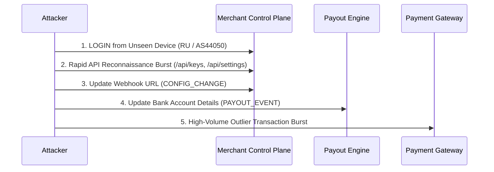

# RiskSūtra — Temporal Workflow Integrity Specification

> **Module**: `backend/risk/workflow_engine.py`  
> **Entity**: `WorkflowIntegrityEngine`

---

## 1. Executive Summary

Static anomaly detection fails when sophisticated attackers perform actions that appear individually plausible. The **Workflow Integrity Engine** evaluates ordered sequences of events to detect malicious progression patterns indicative of control-plane Account Takeover (ATO).

---

## 2. Recognized Attack Chain Patterns

### Pattern Rules
1. **`NEW_DEVICE_TO_SENSITIVE_ACTION`** (Weight: 0.40):  
   Triggered when a `NEW_DEVICE` or `NEW_COUNTRY` event is followed within 15–30 minutes by `CONFIG_CHANGE` or `PAYOUT_EVENT`.
2. **`API_BURST_TO_PAYOUT_CHANGE`** (Weight: 0.35):  
   Triggered when 5+ API requests occur in under 2 minutes followed immediately by a payout destination change.
3. **`CONTROL_PLANE_TAKEOVER_CHAIN`** (Weight: 0.50):  
   Full 4+ step progression from novel identity access to payout hijack and rapid drain transactions.
4. **`UNUSUAL_HOUR_SENSITIVE_SURGE`** (Weight: 0.25):  
   Administrative changes executing during off-peak historical hours.

---

## 3. Legitimate Sale Spike Differentiating

High transaction volume campaigns (e.g. Flash Sales, Black Friday) are evaluated with contextual awareness:
- If transactions surge **without novel devices**, **without geo shifts**, and **without control plane modifications**, the workflow engine output remains **`workflow_score = 0.05`**.
- This guarantees zero false positive incident creation for legitimate sales campaigns!
